# Agricultural Benefit Distribution and Monitoring System Diagrams

This document contains various diagrams illustrating the architecture and data relationships of the Agricultural Benefit Distribution and Monitoring System.

## Table of Contents
- [Conceptual Diagram](#conceptual-diagram)
- [Entity-Relationship Diagram](#entity-relationship-diagram)
- [Physical Data Model](#physical-data-model)
- [Database Table Visualizations](#database-table-visualizations)
- [System Architecture Diagram](#system-architecture-diagram)
- [User Flow Diagram](#user-flow-diagram)
- [Component Diagram](#component-diagram)
- [Use Case Diagram](#use-case-diagram)
- [Sequence Diagrams](#sequence-diagrams)
- [Deployment Diagram](#deployment-diagram)
- [Context Diagram](#context-diagram)
- [Data Flow Diagram](#data-flow-diagram)

## Conceptual Diagram

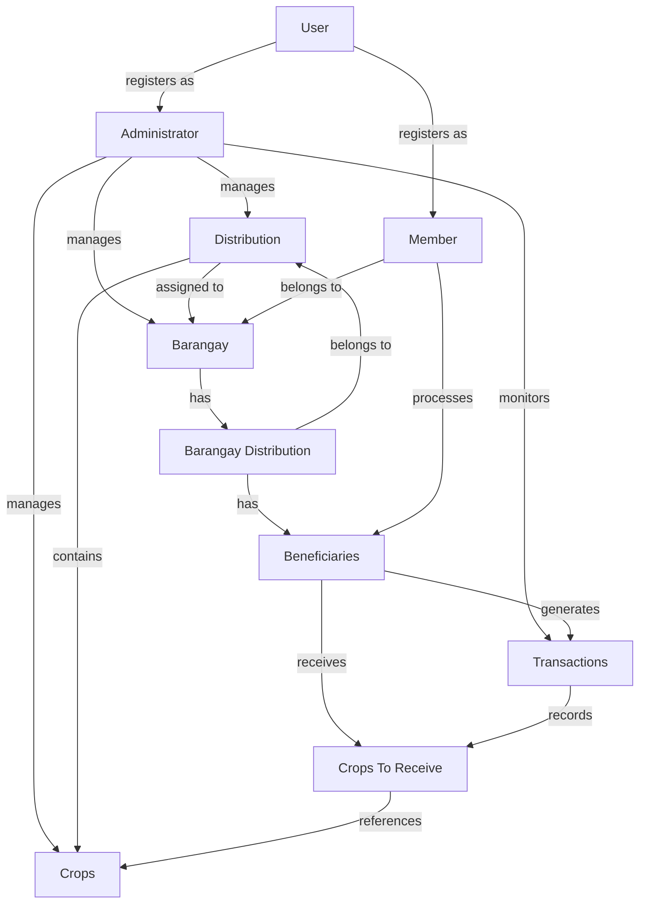

## Entity-Relationship Diagram

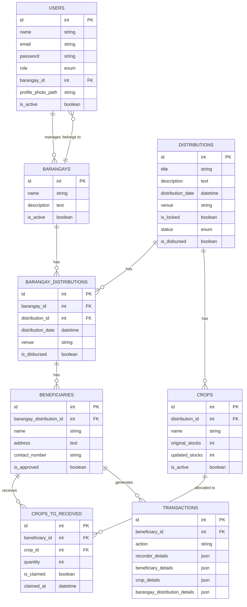

## Physical Data Model

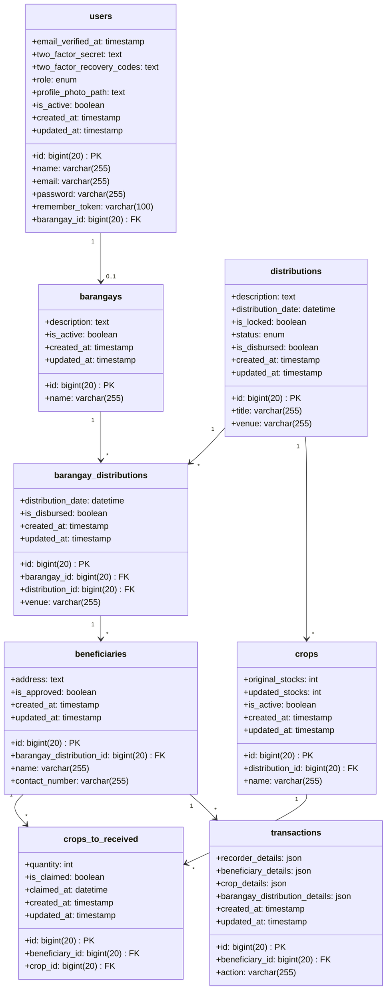

## Database Table Visualizations

### Users Table

| Column Name | Data Type | Constraints | Description |
|------------|-----------|-------------|-------------|
| id | bigint(20) | PRIMARY KEY | Unique identifier for users |
| name | varchar(255) | NOT NULL | User's full name |
| email | varchar(255) | UNIQUE, NOT NULL | User's email address |
| email_verified_at | timestamp | NULL | When email was verified |
| password | varchar(255) | NOT NULL | Hashed password |
| remember_token | varchar(100) | NULL | Token for "remember me" functionality |
| barangay_id | bigint(20) | FOREIGN KEY, NULL | Reference to barangays table |
| role | enum | NOT NULL | User role (Admin, Member) |
| profile_photo_path | text | NULL | Path to profile photo |
| is_active | boolean | DEFAULT true | Whether user is active |
| created_at | timestamp | NULL | Record creation timestamp |
| updated_at | timestamp | NULL | Record update timestamp |

### Barangays Table

| Column Name | Data Type | Constraints | Description |
|------------|-----------|-------------|-------------|
| id | bigint(20) | PRIMARY KEY | Unique identifier for barangays |
| name | varchar(255) | NOT NULL | Name of the barangay |
| description | text | NULL | Description of the barangay |
| is_active | boolean | DEFAULT true | Whether barangay is active |
| created_at | timestamp | NULL | Record creation timestamp |
| updated_at | timestamp | NULL | Record update timestamp |

### Distributions Table

| Column Name | Data Type | Constraints | Description |
|------------|-----------|-------------|-------------|
| id | bigint(20) | PRIMARY KEY | Unique identifier for distributions |
| title | varchar(255) | NOT NULL | Title of the distribution |
| description | text | NULL | Description of the distribution |
| distribution_date | datetime | NULL | Date of the distribution |
| venue | varchar(255) | NULL | Venue of the distribution |
| is_locked | boolean | DEFAULT false | Whether distribution is locked |
| status | enum | DEFAULT 'Planned' | Status of the distribution |
| is_disbursed | boolean | DEFAULT false | Whether distribution is disbursed |
| created_at | timestamp | NULL | Record creation timestamp |
| updated_at | timestamp | NULL | Record update timestamp |

### Barangay Distributions Table

| Column Name | Data Type | Constraints | Description |
|------------|-----------|-------------|-------------|
| id | bigint(20) | PRIMARY KEY | Unique identifier for barangay distributions |
| barangay_id | bigint(20) | FOREIGN KEY | Reference to barangays table |
| distribution_id | bigint(20) | FOREIGN KEY | Reference to distributions table |
| distribution_date | datetime | NULL | Date of the distribution for this barangay |
| venue | varchar(255) | NULL | Venue of the distribution for this barangay |
| is_disbursed | boolean | DEFAULT false | Whether distribution is disbursed to this barangay |
| created_at | timestamp | NULL | Record creation timestamp |
| updated_at | timestamp | NULL | Record update timestamp |

### Beneficiaries Table

| Column Name | Data Type | Constraints | Description |
|------------|-----------|-------------|-------------|
| id | bigint(20) | PRIMARY KEY | Unique identifier for beneficiaries |
| barangay_distribution_id | bigint(20) | FOREIGN KEY | Reference to barangay_distributions table |
| name | varchar(255) | NOT NULL | Name of the beneficiary |
| address | text | NULL | Address of the beneficiary |
| contact_number | varchar(255) | NULL | Contact number of the beneficiary |
| is_approved | boolean | DEFAULT false | Whether beneficiary is approved |
| created_at | timestamp | NULL | Record creation timestamp |
| updated_at | timestamp | NULL | Record update timestamp |

### Crops Table

| Column Name | Data Type | Constraints | Description |
|------------|-----------|-------------|-------------|
| id | bigint(20) | PRIMARY KEY | Unique identifier for crops |
| distribution_id | bigint(20) | FOREIGN KEY | Reference to distributions table |
| name | varchar(255) | NOT NULL | Name of the crop |
| original_stocks | int | NOT NULL | Original stock quantity |
| updated_stocks | int | NOT NULL | Current stock quantity |
| is_active | boolean | DEFAULT true | Whether crop is active |
| created_at | timestamp | NULL | Record creation timestamp |
| updated_at | timestamp | NULL | Record update timestamp |

### Crops To Received Table

| Column Name | Data Type | Constraints | Description |
|------------|-----------|-------------|-------------|
| id | bigint(20) | PRIMARY KEY | Unique identifier |
| beneficiary_id | bigint(20) | FOREIGN KEY | Reference to beneficiaries table |
| crop_id | bigint(20) | FOREIGN KEY | Reference to crops table |
| quantity | int | NOT NULL | Quantity to be received |
| is_claimed | boolean | DEFAULT false | Whether crop has been claimed |
| claimed_at | datetime | NULL | When the crop was claimed |
| created_at | timestamp | NULL | Record creation timestamp |
| updated_at | timestamp | NULL | Record update timestamp |

### Transactions Table

| Column Name | Data Type | Constraints | Description |
|------------|-----------|-------------|-------------|
| id | bigint(20) | PRIMARY KEY | Unique identifier for transactions |
| beneficiary_id | bigint(20) | FOREIGN KEY | Reference to beneficiaries table |
| action | varchar(255) | NOT NULL | Action performed (claim, revert) |
| recorder_details | json | NULL | Details of the user who recorded the transaction |
| beneficiary_details | json | NULL | Snapshot of beneficiary details |
| crop_details | json | NULL | Snapshot of crop details |
| barangay_distribution_details | json | NULL | Snapshot of barangay distribution details |
| created_at | timestamp | NULL | Record creation timestamp |
| updated_at | timestamp | NULL | Record update timestamp |

### Database Relationship Visualization

```
+---------------+     +---------------+     +---------------+
|    Users      |     |   Barangays   |     | Distributions |
+---------------+     +---------------+     +---------------+
| id            |<--->| id            |     | id            |
| name          |     | name          |<--->| title         |
| email         |     | description   |     | description   |
| password      |     | is_active     |     | dist_date     |
| barangay_id   |     +---------------+     | venue         |
| role          |            ^             | status        |
| is_active     |            |             | is_locked     |
+---------------+            |             | is_disbursed  |
        ^                    |             +---------------+
        |                    |                     ^        
        |                    |                     |        
        |                    v                     |        
+---------------+     +---------------+     +---------------+
| Transactions  |     | Barangay_Dist |     |    Crops      |
+---------------+     +---------------+     +---------------+
| id            |     | id            |     | id            |
| beneficiary_id|     | barangay_id   |<--->| distribution_id|
| action        |     | distribution_id|    | name          |
| recorder_det  |     | dist_date     |     | original_stocks|
| beneficiary_det|    | venue         |     | updated_stocks|
| crop_det      |     | is_disbursed  |     | is_active     |
+---------------+     +---------------+     +---------------+
        ^                     ^                    ^        
        |                     |                    |        
        |                     v                    |        
        |             +---------------+            |        
        |             | Beneficiaries |            |        
        |             +---------------+            |        
        +------------>| id            |            |        
                      | barangay_dist_id|          |        
                      | name          |            |        
                      | address       |            |        
                      | contact_number|            |        
                      | is_approved   |            |        
                      +---------------+            |        
                              ^                    |        
                              |                    |        
                              v                    v        
                      +---------------+                     
                      | CropsToReceived|                     
                      +---------------+                     
                      | id            |                     
                      | beneficiary_id|                     
                      | crop_id       |                     
                      | quantity      |                     
                      | is_claimed    |                     
                      | claimed_at    |                     
                      +---------------+                     
```

## System Architecture Diagram

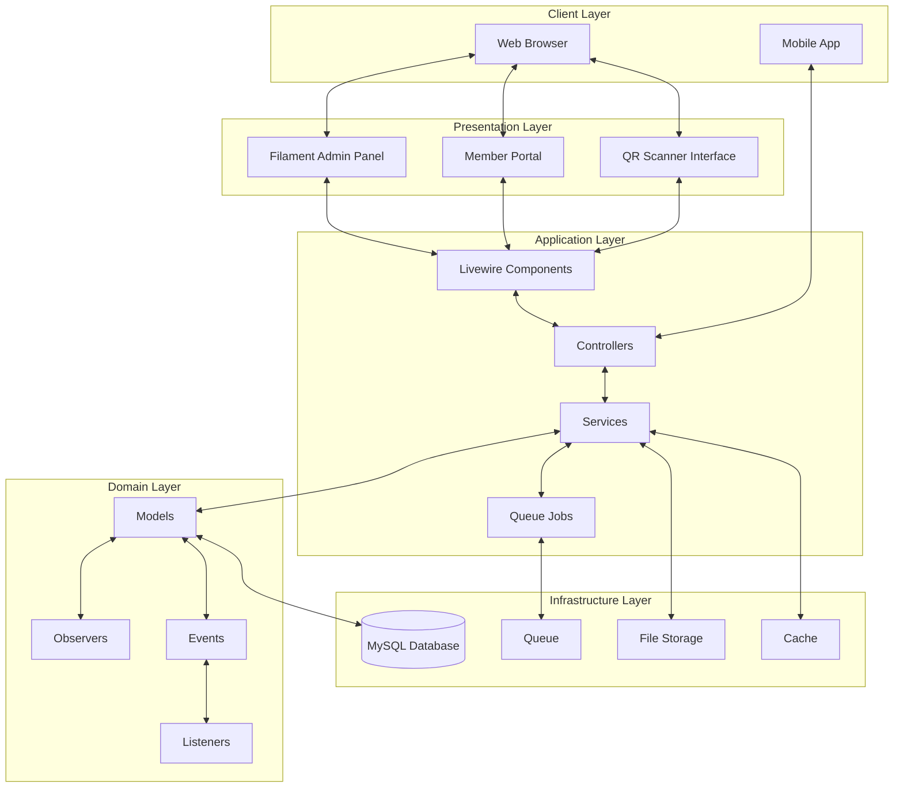

## User Flow Diagram

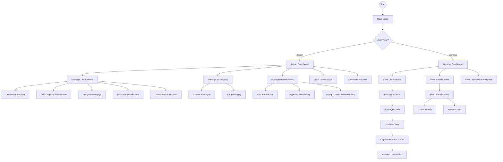

## Component Diagram

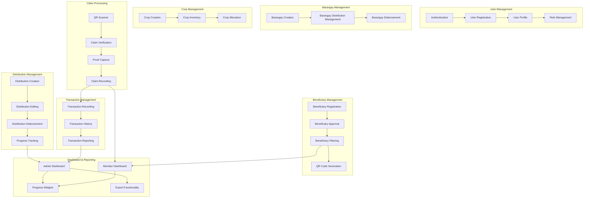

## Use Case Diagram

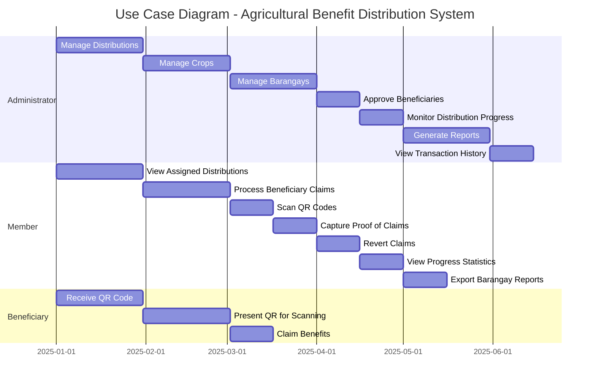

### ASCII Use Case Diagram

```
+-------------------+    +-------------------+    +-------------------+
|   ADMINISTRATOR   |    |      MEMBER       |    |    BENEFICIARY    |
+-------------------+    +-------------------+    +-------------------+
| - Manage Distrib. |    | - View Distrib.  |    | - Receive QR Code |
| - Manage Crops    |    | - Process Claims |    | - Present QR Code |
| - Manage Barangays|    | - Scan QR Codes  |    | - Claim Benefits  |
| - Approve Benef.  |    | - Capture Proof  |    +-------------------+
| - Monitor Progress|    | - Revert Claims  |
| - Generate Reports|    | - View Progress  |
| - View History    |    | - Export Reports |
+-------------------+    +-------------------+
```

## Sequence Diagrams

### Benefit Claim Sequence

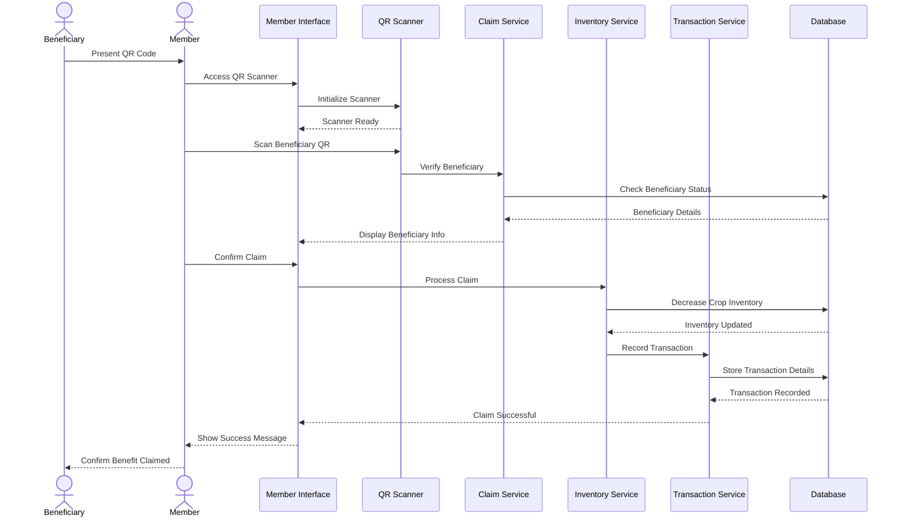

### ASCII Benefit Claim Sequence

```
Beneficiary    Member    UI    Scanner    Claim    Inventory    Transaction    DB
    |            |       |        |         |           |             |          |
    |--Present-->|       |        |         |           |             |          |
    |            |--Access->      |         |           |             |          |
    |            |       |--Init-->|         |           |             |          |
    |            |       |<-Ready--|         |           |             |          |
    |            |--Scan-->|        |         |           |             |          |
    |            |       |--Verify-->|         |           |             |          |
    |            |       |        |--Check---------------------------->|          |
    |            |       |        |<-Details----------------------------|          |
    |            |       |<-Display-|         |           |             |          |
    |            |--Confirm->      |         |           |             |          |
    |            |       |--Process---------->|           |             |          |
    |            |       |        |         |--Decrease---------------->|          |
    |            |       |        |         |<-Updated------------------|          |
    |            |       |        |         |--Record----->|             |          |
    |            |       |        |         |           |--Store-------->|          |
    |            |       |        |         |           |<-Recorded------|          |
    |            |       |<-Success---------|-----------|--------------          |
    |            |<-Success-|      |         |           |             |          |
    |<-Confirm---|       |        |         |           |             |          |
    |            |       |        |         |           |             |          |
```

### Distribution Disbursement Sequence

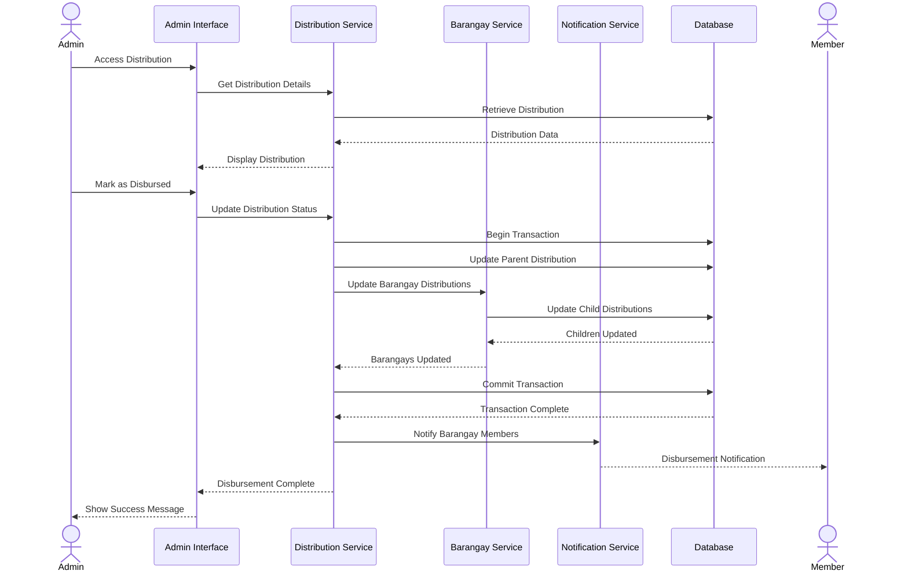

## Deployment Diagram

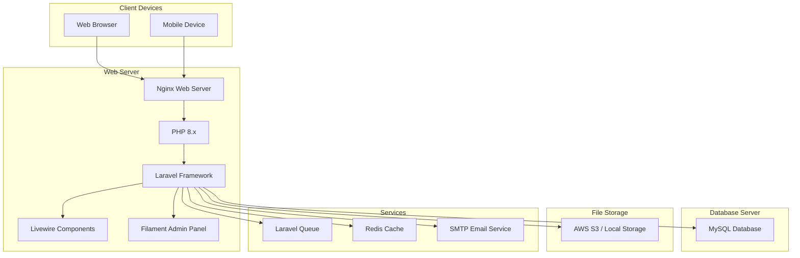

### ASCII Deployment Diagram

```
+------------------+     +------------------+
|  Client Devices  |     |   Web Server    |
+------------------+     +------------------+
| - Web Browser    |---->| - Nginx         |
| - Mobile Device  |     | - PHP 8.x       |
+------------------+     | - Laravel       |----+
                         | - Livewire      |    |
                         | - Filament      |    |
                         +------------------+    |
                                |                |
                                v                v
+------------------+     +------------------+    |    +------------------+
| Database Server  |<----| Services         |<---+----| File Storage     |
+------------------+     +------------------+         +------------------+
| - MySQL Database |     | - Laravel Queue |         | - AWS S3         |
+------------------+     | - Redis Cache   |         | - Local Storage  |
                         | - SMTP Email    |         +------------------+
                         +------------------+
```

## Context Diagram

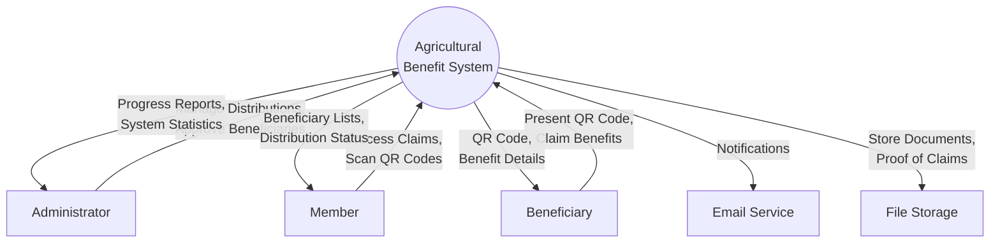

### ASCII Context Diagram

```
                 +--------------------+
                 |                    |
    +----------->|    Agricultural    |<-----------+
    |            |   Benefit System   |            |
    |            |                    |            |
    |            +--------------------+            |
    |                ^    |     ^  |               |
    |                |    |     |  |               |
    |                |    v     |  v               |
+---+----+      +----+---+    ++---+--+      +----+---+
|        |      |        |    |       |      |        |
| Admin  |<---->| Member |    | Benef.|      | Email  |
|        |      |        |    |       |      | Service|
+--------+      +--------+    +-------+      +--------+
                                   ^               ^
                                   |               |
                                   |               |
                                   v               |
                              +--------+          |
                              |        |          |
                              | File   |----------+
                              | Storage|
                              +--------+
```

## Data Flow Diagram

### Level 0 DFD

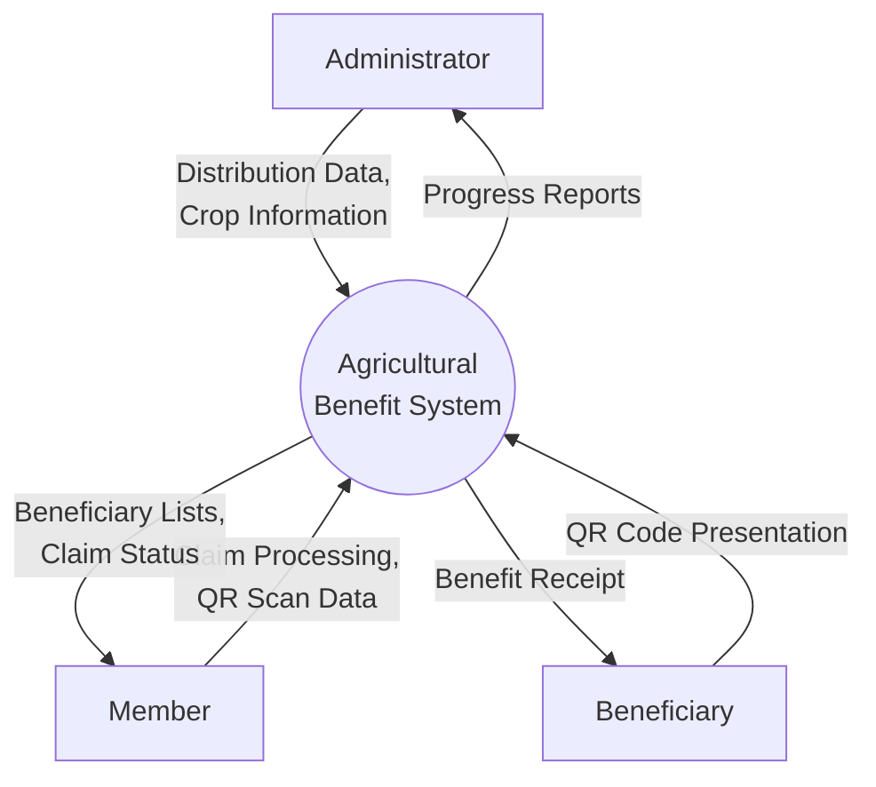

### ASCII Level 0 DFD

```
+---------+                              +---------+
|         |  Distribution Data           |         |
| Admin   |------------------------------>|         |
|         |  Crop Information            |         |
+---------+                              |         |
                                         |         |
+---------+                              |         |
|         |  Claim Processing            | Agri.   |
| Member  |------------------------------>| Benefit |
|         |  QR Scan Data                | System  |
+---------+                              |         |
                                         |         |
+---------+                              |         |
|         |  QR Code Presentation        |         |
| Benef.  |------------------------------>|         |
|         |                              |         |
+---------+                              +---------+
              Progress Reports             |  |  |
              <-----------------------------+  |  |
                                               |  |
              Beneficiary Lists, Claim Status  |  |
              <-------------------------------+  |
                                                  |
              Benefit Receipt                     |
              <---------------------------------+
```

### Level 1 DFD

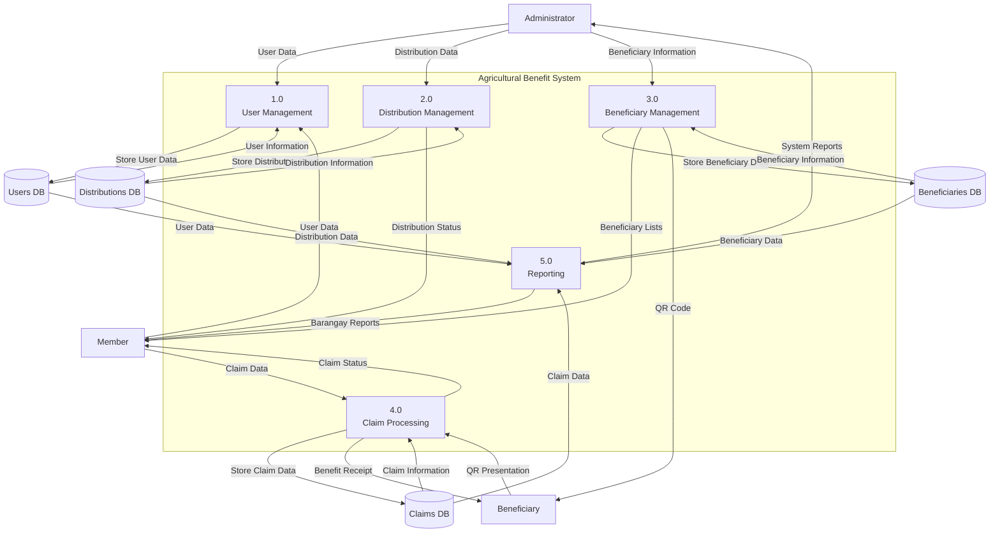
